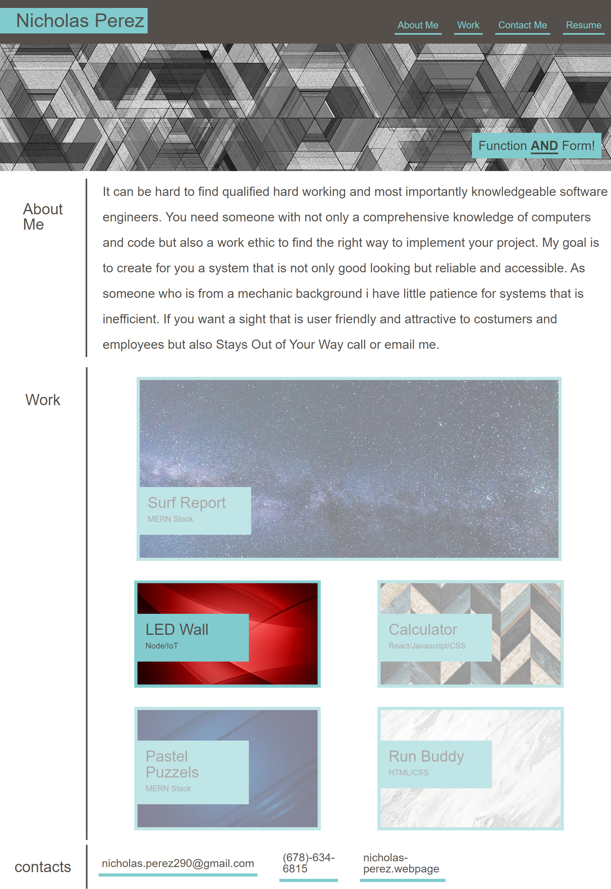

# n-perez-portfolio-1

- The goal of this program is to display my past works in an attractive and adaptive format that works on both mobile and pc.

# This includes

- giving my contact info

- A description about me and why I am a good fit for your coding needs

- Animated links to five of my projects

- Animated Navigation buttons

- My contact info

# Usage

- For employer looking for a coder

- To show off my past work and what I can do

- To contact me about ongoing projects

# Image of website

- 

# links

- Link to website: https://nicholasperez290.github.io/n-perez-portfolio-1/
